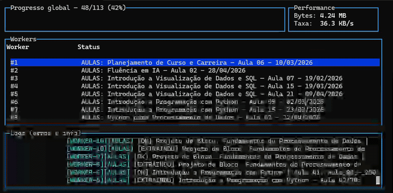
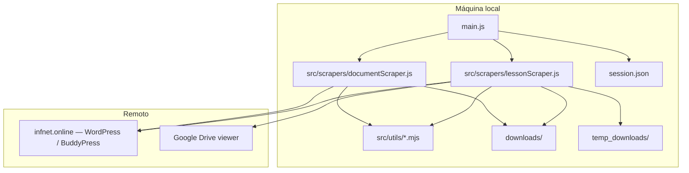

<p align="center">
  
</p>

# StripperScrapper

> Ferramenta **local** (Node.js + Puppeteer) que automatiza, para um utilizador autenticado no portal **Infnet** (`infnet.online`, WordPress), a extração de **transcrições de aulas** (via Google Drive) e de **documentos BuddyPress**, com cópia organizada no disco e metadados em Markdown onde aplicável.

Não existe servidor HTTP nem API exposta: tudo corre na máquina do utilizador. A referência técnica completa está em [`documentation.md`](./documentation.md).

## Table of Contents

- [Propósito e âmbito](#propósito-e-âmbito)
- [O que faz (e o que não faz)](#o-que-faz-e-o-que-não-faz)
- [Quick start](#quick-start)
- [Comandos e orquestrador](#comandos-e-orquestrador)
- [Dashboard (TUI)](#dashboard-tui)
- [Modo cluster / multi-worker](#modo-cluster--multi-worker)
- [Variáveis de ambiente](#variáveis-de-ambiente)
- [Visão do sistema](#visão-do-sistema)
- [Arquitetura resumida](#arquitetura-resumida)
- [Saídas no disco e idempotência](#saídas-no-disco-e-idempotência)
- [Resiliência (retries, integridade, DLQ)](#resiliência-retries-integridade-dlq)
- [API programática (`toMarkdown`)](#api-programática-tomarkdown)
- [Segurança e conformidade](#segurança-e-conformidade)
- [Troubleshooting](#troubleshooting)
- [Manutenção e documentação](#manutenção-e-documentação)

## Propósito e âmbito

| Aspeto | Descrição |
|--------|-----------|
| **Problema** | Conteúdos ficam atrás de login e de UI web (Drive, listagens BuddyPress), sem endpoint público estável. |
| **Solução** | Replicar o fluxo humano com browser controlado; transcrições com CDP + rename + `.md`; documentos com `fetch` autenticado no Node. |
| **Quem usa** | Quem tem **acesso legítimo** ao conteúdo e pretende **cópia local** organizada. |

O nome do repositório é um jogo de palavras com “strip” (extração) e “scraper”; o âmbito é **extração autorizada** para uso pessoal/académico.

**Dependência de UI:** seletores em `infnet.online`, Drive e BuddyPress podem mudar; ver notas em [`documentation.md`](./documentation.md) e, se existir localmente, `VALIDACAO_SELETORES.md`.

## O que faz (e o que não faz)

**Faz**

- Arranca Chrome (ou caminho em env), opcionalmente visível (`--headed` / `HEADLESS=0`).
- Reutiliza ou cria `session.json` (cookies + `localStorage`).
- **Aulas:** lista itens de gravação, abre transcrição no Drive, descarrega, move de `temp_downloads/` e gera `.md` com front-matter.
- **Documentos:** percurso em `/documents/`, download com cookies da sessão, extensões configuráveis (por defeito `pdf`, `pptx`, `xlsx`).
- **Orquestrador:** `--all`, `--lessons`, `--docs`, `--fail-fast` (ou `ORCHESTRATOR_FAIL_FAST`); `browser.close()` no `finally`.

**Não faz**

- Não fornece credenciais nem contorna MFA fora do que o browser já tiver em sessão.
- Não garante compatibilidade eterna com alterações de HTML nos sites.
- Não substitui políticas da instituição ou termos de serviço — o utilizador é responsável pelo uso conforme contratos e leis aplicáveis.

## Quick start

1. Copiar o exemplo de ambiente e editar credenciais / URLs:

   ```bash
   copy .env.example .env
   ```

   Mínimo típico: `FACULDADE_USER`, `FACULDADE_PASS`; opcionalmente `CLASSES_URL`, `DOCUMENTS_URL`, etc. (ver tabela abaixo).

2. Instalar e correr (é obrigatório passar `--lessons`, `--docs` ou `--all`):

   ```bash
   npm install
   npm start -- --lessons
   ```

3. Browser visível: `npm start -- --lessons --headed` ou `HEADLESS=0` no `.env`.

**Windows PowerShell (sessão visível):**

```powershell
$env:HEADLESS="0"; npm run lessons -- --limit=2
```

## Comandos e orquestrador

| npm | Equivalente |
|-----|----------------|
| `npm start` / `npm run main` | `node main.js` |
| `npm run all` | `node main.js --all` |
| `npm run lessons` / `npm run stripper` | `node main.js --lessons` |
| `npm run docs` / `npm run documents` | `node main.js --docs` |

`node main.js` sem `--lessons`, `--docs` ou `--all` mostra a ajuda do Commander e termina com código **1**.

### Flags do orquestrador (`main.js`)

| Opção | Efeito |
|-------|--------|
| `--all` | Aulas e, em seguida, documentos na **mesma** instância do browser (quando sequencial). |
| `--lessons` | Apenas módulo de aulas. |
| `--docs` | Apenas módulo de documentos. |
| `--workers <n>` | Modo cluster: ver [Modo cluster](#modo-cluster--multi-worker). |
| `--sequential` | Um browser, execução em série (comportamento clássico). |
| `--fail-fast` | Se **aulas** falharem com exceção, **não** corre documentos. |
| `--no-dashboard` | Desativa o dashboard TUI (útil em CI ou piping). |

`ORCHESTRATOR_FAIL_FAST` (`1` / `true` / `yes`) equivale a `--fail-fast`.

### Flags comuns dos scrapers (ficam em `argv`)

Exemplos: `--limit=N`, `--headed` / `--show`, `--documents-url=`, `--output=`, `--dry-run`, `--no-download`, `--ignore-manifest`, `--max-depth=`, `--extensions=`. Detalhe em [`documentation.md`](./documentation.md).

## Dashboard (TUI)

Com terminal interativo (TTY) e modo com workers, o orquestrador mostra **progresso global**, **métricas de transferência**, **estado por worker** e **logs** em tempo real (`blessed` / `blessed-contrib`). Gravação de exemplo:

<p align="center">
  
</p>

Por defeito o dashboard está ativo; usa `--no-dashboard` para saída só em texto (CI, pipes ou ambientes sem TTY adequado).

## Modo cluster / multi-worker

Ativa quando `--workers <n>` com **n > 1** e **sem** `--sequential`.

1. **Mapeamento:** o processo pai abre um browser e descobre tarefas (`discoverLessonTasks` / `discoverDocumentTasks`).
2. **Sharding:** partição determinística com `partitionTasksForWorker`.
3. **Download:** cada worker abre o seu browser (por defeito **headless** nos workers para poupar RAM; `--headed` mantém visibilidade útil para depuração).

Antes do sharding, tarefas já concluídas (manifest + verificação de artefactos) são filtradas — reexecutar é **idempotente**.

Pastas temporárias por worker nas aulas: `temp_downloads/worker-<id>` (evita colisões).

Exemplos:

```bash
node main.js --all --workers 4
node main.js --lessons --workers 3
node main.js --all --sequential
node main.js --all --workers 2 --headed
```

Limites: RAM, CPU e rede escalam com o número de browsers; começar com **2–4 workers** costuma ser razoável.

## Variáveis de ambiente

### Aulas / orquestrador / geral

| Variável | Obrigatório | Descrição |
|----------|-------------|-----------|
| `FACULDADE_USER` | Se for preciso login após sessão | E-mail WordPress Infnet |
| `FACULDADE_PASS` | Idem | Senha |
| `CLASSES_URL` | Não | URL da página de reuniões |
| `DISCIPLINE_NAME` ou `COURSE_NAME` | Não | Nome da disciplina nos metadados; senão inferido |
| `PUPPETEER_EXECUTABLE_PATH` | Condicional | Caminho absoluto ao Chrome se a resolução automática falhar |
| `HEADLESS` | Não | `0` força browser visível (com `--headed`) |
| `ORCHESTRATOR_FAIL_FAST` | Não | Igual a `--fail-fast` |

### Documentos

| Variável | Descrição |
|----------|-----------|
| `DOCUMENTS_URL` | URL raiz da área de documentos |
| `DOCUMENTS_OUTPUT_DIR` | Saída (default `downloads/documents` sob a raiz do projeto) |
| `DOCUMENTS_MAX_DEPTH` | Profundidade máxima de pastas (default 32) |
| `DOCUMENTS_MAX_BYTES` | Limite por ficheiro (default 500 MiB) |
| `DOCUMENTS_FETCH_TIMEOUT_MS` | Timeout do `fetch` (default 300000) |
| `DOCUMENTS_IGNORE_MANIFEST` | `1` / `true` / `yes` — ignora manifest |

## Visão do sistema



## Arquitetura resumida

| Path | Papel |
|------|--------|
| `main.js` | Orquestrador CLI (Commander), browser partilhado em modo sequencial, cluster opcional |
| `src/scrapers/lessonScraper.js` | Aulas / Drive + manifest `transcript`; exports incl. `toMarkdown`, `runLessonScraperStandalone` |
| `src/scrapers/documentScraper.js` | Documentos BuddyPress + manifest `document`; `discoverDocumentTasks`, standalone |
| `src/utils/infnetShared.mjs` | Sessão, login, Chrome, caminhos seguros, `ensureAuthenticated` |
| `src/utils/downloadManifest.mjs` | `manifest.json`, IDs estáveis, conclusão e locks |
| `src/utils/browser.mjs` | `launchBrowser`, resolução do executável |
| `src/utils/shard.mjs` | Partição de tarefas entre workers |
| `src/utils/workerLog.mjs` | Logs por worker (`chalk`) |
| `src/utils/retry.mjs` | Retries com backoff |
| `src/utils/integrity.mjs` | Validação de ficheiros antes de marcar concluído |
| `src/utils/dashboard.mjs` | Dashboard TUI (progresso, workers, ETA) |

**Stack:** Node.js **ESM** (`"type": "module"`), `puppeteer`, `commander`, `dotenv`, `chalk`, `blessed` / `blessed-contrib`.

Fluxo sequencial típico (`--all`): `launchBrowser` → `newPage` → aulas (se ativas) → documentos (se ativos e não abortados por fail-fast) → `browser.close()` no `finally`.

## Saídas no disco e idempotência

| Caminho | Conteúdo |
|---------|----------|
| `downloads/<Secção>/` | Transcrições + `.md` por item |
| `downloads/documents/` | Árvore de documentos (default) |
| `downloads/manifest.json` | Estado por ID estável (transcrições + documentos quando a saída está sob `downloads/`) |
| `temp_downloads/` | Buffer de download do Chrome |
| `session.json` | Cookies + `localStorage` — **não commitar** |

**Front-matter** nos `.md` das aulas (campos principais): `title`, `source_url`, `course`, `transcript_file`, `downloaded_at`.

O manifest evita reprocessar itens já concluídos (e pode reverificar se o ficheiro ainda existe no disco). Detalhes de locks e concorrência: [`documentation.md`](./documentation.md).

## Resiliência (retries, integridade, DLQ)

- Até **3 tentativas** por item com backoff e jitter em falhas transitórias ou de integridade.
- Validação antes de marcar concluído: ficheiro não vazio, sniff para evitar HTML (sessão expirada), e em documentos validação de tamanho quando `content-length` existe.
- Itens que falham após retries podem ficar no manifest com `status: "error"` (**DLQ**) para auditoria.

## API programática (`toMarkdown`)

Não depende do Puppeteer — útil para converter um `.vtt` já descarregado:

```javascript
import { toMarkdown } from './src/scrapers/lessonScraper.js';

await toMarkdown('/caminho/para/ficheiro.vtt', {
  title: 'Aula 1',
  source_url: 'https://…',
  course: 'Nome da disciplina',
  downloaded_at: new Date().toISOString(), // opcional
});
```

## Segurança e conformidade

- Credenciais apenas em `.env` local; não commitar `.env` nem `session.json`.
- O projeto não escuta portas; o risco principal é **exposição de ficheiros sensíveis** no disco ou em backups.
- Automatização pode conflitar com termos da Infnet ou Google — avaliar no teu contexto institucional.

## Troubleshooting

<details>
<summary>Chrome não encontrado ao lançar</summary>

Instalar Chrome ou definir `PUPPETEER_EXECUTABLE_PATH`. Com pouco disco: `PUPPETEER_SKIP_DOWNLOAD=true npm install` e usar Chrome do sistema. O código imprime ajuda via `printChromeHelp`.
</details>

<details>
<summary>Lista vazia — nenhum `.infnetci-recording-item`</summary>

Sessão sem permissão, URL errada ou HTML alterado. Correr com `--headed`; ajustar seletores em `src/scrapers/lessonScraper.js` se o layout mudou.
</details>

<details>
<summary>Timeout ou botão de download no Drive não encontrado</summary>

UI do Drive varia (iframe, idioma). O código percorre frames e vários rótulos; pode ser necessária interação manual uma vez ou novos seletores.
</details>

<details>
<summary>Login falha com credenciais corretas</summary>

MFA ou captchas não tratados pelo script. Apagar `session.json` e tentar com `--headed`.
</details>

<details>
<summary>Documentos: ficheiro HTML em vez de PDF</summary>

Sessão expirada ou sem permissão. Verificar `DOCUMENTS_URL` e voltar a autenticar.
</details>

## Manutenção e documentação

| Artefacto | Papel |
|-----------|--------|
| [**documentation.md**](./documentation.md) | Referência técnica: fluxos, cluster, manifest, CLI completa, ciclo de sessão, limitações |
| **README.md** (este ficheiro) | Onboarding e operação rápida |
| **`VALIDACAO_SELETORES.md`** | Se existir localmente, checklist de regressão visual (pode estar no `.gitignore`) |
| **`.agent_history.md`** | Se existir na raiz, decisões de fluxos de agente |

*Em caso de divergência entre documentação e comportamento, prevalece o código em `main.js` e `src/`.*

---

Licença e badges de CI: não definidos neste repositório; adicionar apenas com fonte verificável.
