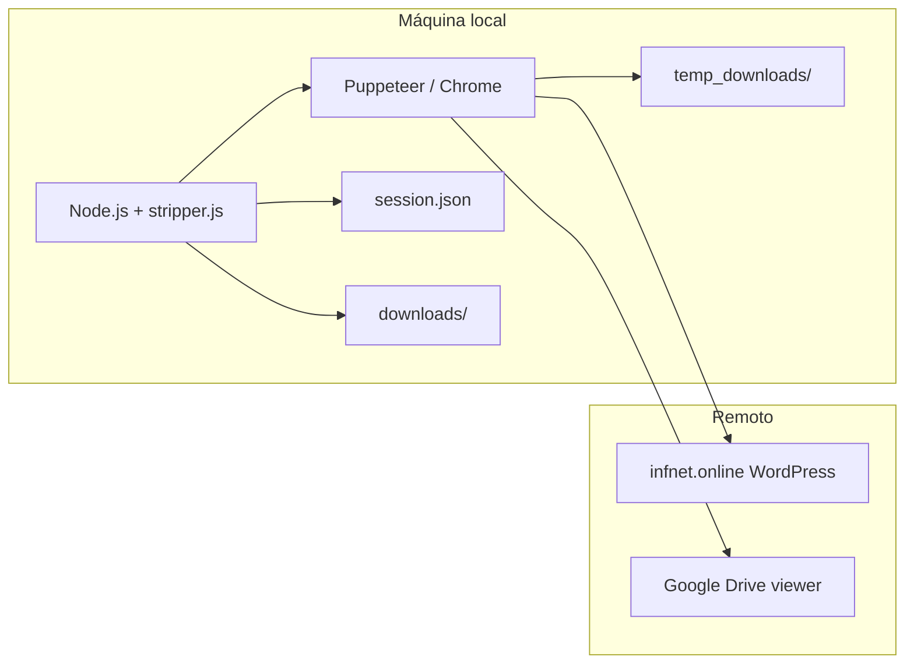
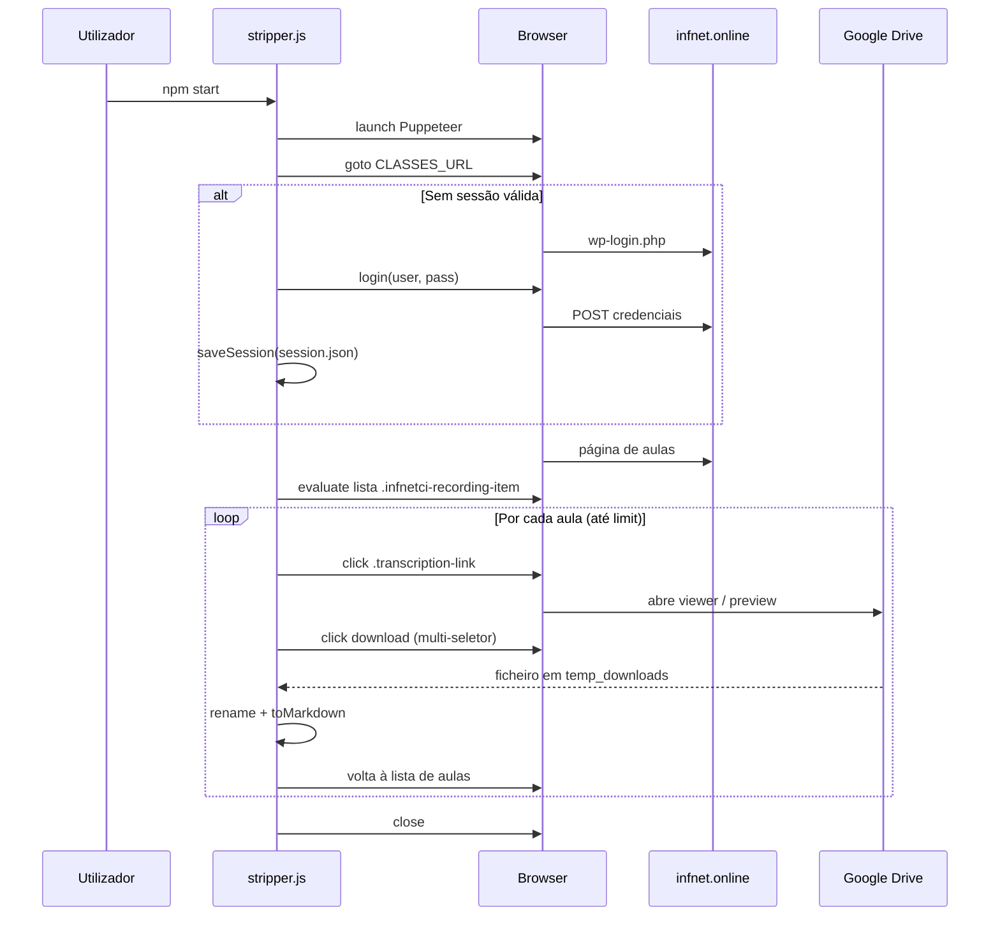

<p align="center">
  
</p>

# StripperScrapper

> Extração local de transcrições acadêmicas a partir do portal Infnet (WordPress + Google Drive), quando não há API pública para o mesmo dado.

O projeto automatiza login, navegação na página de reuniões/gravações e download dos ficheiros de transcrição, gerando para cada ficheiro um `.md` com front-matter YAML (metadados) ao lado do binário descarregado (ex.: `.vtt`).

## Table of Contents

- [Porque existe](#porque-existe)
- [Quick Start](#quick-start)
- [Visão do sistema](#visão-do-sistema)
- [Arquitetura](#arquitetura)
- [Fluxos de dados e estado](#fluxos-de-dados-e-estado)
- [Referência CLI e variáveis de ambiente](#referência-cli-e-variáveis-de-ambiente)
- [Ficheiros gerados e pastas](#ficheiros-gerados-e-pastas)
- [Troubleshooting](#troubleshooting)
- [Manutenção e documentação auxiliar](#manutenção-e-documentação-auxiliar)

## Porque existe

Plataformas académicas costumam expor transcrições através de páginas autenticadas e links para visualizadores (p.ex. Google Drive), sem um endpoint estável para integração. Este scraper **replica o percurso humano** (sessão, lista de aulas, abrir transcrição, acionar “Baixar”) para **materializar ficheiros no disco** e **normalizar metadados** num Markdown legível por ferramentas de notas, RAG ou arquivo pessoal.

**Âmbito consciente:** depende da estrutura HTML/CSS atual (`infnet.online`) e da UI do Drive; alterações no site podem exigir ajuste de seletores (ver `VALIDACAO_SELETORES.md`).

## Quick Start

1. Copiar credenciais e URL (opcional) a partir do exemplo:

   ```bash
   copy .env.example .env
   ```

   Editar `.env` com `FACULDADE_USER`, `FACULDADE_PASS` e, se necessário, `CLASSES_URL`.

2. Instalar dependências e executar:

   ```bash
   npm install
   npm start
   ```

   Para ver o browser: `npm start -- --headed` ou `HEADLESS=0` no `.env`.

## Visão do sistema



- **Entrada:** URL da turma/disciplina (`CLASSES_URL` ou default no código), credenciais no `.env`, sessão reutilizável em `session.json`.
- **Saída:** ficheiros de transcrição por secção/pasta + `.md` com YAML front-matter por item.

## Arquitetura

O núcleo é um único módulo ESM, `stripper.js`, que:

1. **Resolve Chrome** — `PUPPETEER_EXECUTABLE_PATH`, deteção por SO, ou Chromium empacotado pelo Puppeteer.
2. **Autentica** — carrega `session.json` (cookies + `localStorage`); se ainda redirecionar para `wp-login.php`, preenche formulário e grava nova sessão.
3. **Extrai lista** — `page.evaluate` sobre `.infnetci-recording-item` e `.transcription-link`, com título de acordeão associado.
4. **Resolve nome da disciplina** — `DISCIPLINE_NAME` / `COURSE_NAME`, texto da página, ou slug da URL.
5. **Por aula** — abre link (popup ou mesma aba), configura pasta de download via CDP, clica no botão de download do Drive (vários seletores), espera ficheiro estável em `temp_downloads/`, move para `downloads/<secção>/` com nome slugificado e gera `.md` com `toMarkdown()`.

Decisões implícitas no código:

- **Resiliência a UI:** múltiplos seletores para login e para o botão “Baixar” no Drive (incluindo iframes).
- **Windows:** `safeDirName` remove caracteres inválidos em caminhos NTFS.
- **Limitação de corrida:** flag `--limit=N` e `--no-download` para dry-run de URLs.

## Fluxos de dados e estado



Estado persistido:

| Artefacto | Conteúdo |
|-----------|----------|
| `session.json` | Cookies + snapshot de `localStorage` após login bem-sucedido |
| `downloads/<secção>/` | Transcrição + `.md` com `title`, `source_url`, `course`, `transcript_file`, `downloaded_at` |

## Referência CLI e variáveis de ambiente

### Comandos

| Comando | Descrição |
|---------|-----------|
| `npm start` | Equivalente a `node stripper.js` |
| `node stripper.js` | Execução completa |
| `node stripper.js --limit=3` | Processa no máximo 3 itens da lista |
| `node stripper.js --no-download` | Lista URLs e metadados sem descarregar |
| `node stripper.js --headed` ou `--show` | Browser visível (também `HEADLESS=0`) |

### Variáveis de ambiente (`.env`)

| Variável | Obrigatório | Descrição |
|----------|-------------|-----------|
| `FACULDADE_USER` | Se não houver sessão válida | E-mail de login Infnet |
| `FACULDADE_PASS` | Se não houver sessão válida | Senha |
| `CLASSES_URL` | Não | URL da página de reuniões; default aponta para exemplo no código |
| `DISCIPLINE_NAME` ou `COURSE_NAME` | Não | Nome exibido nos metadados; senão inferido da página/URL |
| `PUPPETEER_EXECUTABLE_PATH` | Condicional | Caminho para `chrome` se o download embutido falhar ou for omitido |
| `HEADLESS` | Não | `0` para janela visível |

Exemplo mínimo de invocação com env carregado pelo `dotenv` (após configurar `.env`):

```bash
node stripper.js --limit=1
```

## Ficheiros gerados e pastas

- **`downloads/`** — ignorado pelo Git; estrutura `downloads/<Nome_Da_Secção>/arquivo.ext` + `arquivo.md`.
- **`temp_downloads/`** — área transitória de downloads do Chrome; ignorada pelo Git.
- **Front-matter** (em cada `.md`): campos `title`, `source_url`, `course`, `transcript_file`, `downloaded_at`.

Não commite `session.json` nem `.env` (já listados em `.gitignore`).

## Troubleshooting

<details>
<summary>Chrome não encontrado</summary>

O script imprime instruções: instalar Chrome, definir `PUPPETEER_EXECUTABLE_PATH`, ou `npx puppeteer browsers install chrome`. Em disco limitado: `PUPPETEER_SKIP_DOWNLOAD=true npm install` e usar Chrome do sistema — ver `.env.example` e `VALIDACAO_SELETORES.md`.
</details>

<details>
<summary>Nenhum `.infnetci-recording-item` na página</summary>

Possíveis causas: HTML alterado, disciplina sem gravações listadas, ou sessão sem permissão para essa turma. Correr com `--headed` para inspecionar; atualizar seletores em `stripper.js` se o layout mudou.
</details>

<details>
<summary>Download no Drive falha</summary>

UI do Drive muda (iframe, rótulos em inglês, consentimento). O código tenta vários `aria-label` e frames; pode ser necessário interação manual ou novos seletores.
</details>

## Manutenção e documentação auxiliar

- **`VALIDACAO_SELETORES.md`** — notas de validação de login, redirect e riscos de seletores (2026-04-28).
- **Histórico de agente:** quando existir `.agent_history.md` na raiz, consolidam-se ali decisões de orquestração; neste repositório o ficheiro pode ser criado por fluxos `/orquestrar` — se ausente, a documentação baseia-se apenas no código e nos artefactos versionados.

**Stack:** Node.js (ESM), `puppeteer`, `dotenv`. Não há servidor HTTP nem API exposta — apenas automação local.

---

Licença e badges de CI: não definidos neste repositório; adicionar apenas com fonte verificável (workflow, shields, etc.).
