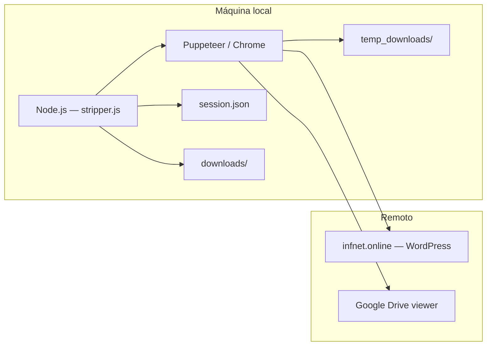
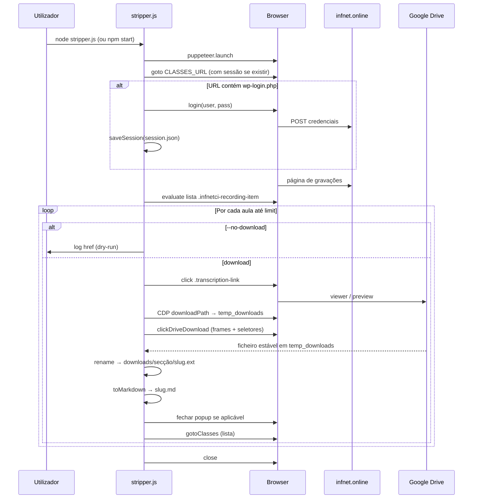
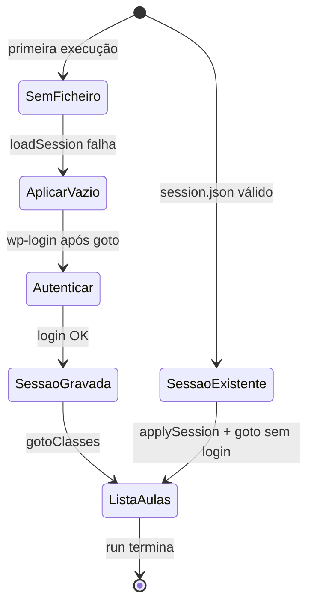

# StripperScrapper — Documentação técnica

> Documento mestre de arquitetura, fluxos e operação. O [README.md](./README.md) permanece o ponto de entrada rápido; este ficheiro aprofunda **propósito**, **comportamento do código** e **limites** do sistema.

## Table of Contents

- [Visão geral](#visão-geral)
- [Propósito e público-alvo](#propósito-e-público-alvo)
- [O que o projeto faz (e o que não faz)](#o-que-o-projeto-faz-e-o-que-não-faz)
- [Stack e pré-requisitos](#stack-e-pré-requisitos)
- [Visão do sistema](#visão-do-sistema)
- [Arquitetura e módulo `stripper.js`](#arquitetura-e-módulo-stripperjs)
- [Fluxos de dados e estado](#fluxos-de-dados-e-estado)
- [Ciclo de vida da sessão](#ciclo-de-vida-da-sessão)
- [Referência CLI e variáveis de ambiente](#referência-cli-e-variáveis-de-ambiente)
- [Saídas no disco](#saídas-no-disco)
- [API programática (`toMarkdown`)](#api-programática-tomarkdown)
- [Segurança, privacidade e conformidade de uso](#segurança-privacidade-e-conformidade-de-uso)
- [Limitações e manutenção](#limitações-e-manutenção)
- [Troubleshooting](#troubleshooting)
- [Relação entre README, este documento e histórico de agente](#relação-entre-readme-este-documento-e-histórico-de-agente)

---

## Visão geral

**StripperScrapper** é uma ferramenta **local** (Node.js + Puppeteer) que automatiza o percurso de um utilizador autenticado no portal académico **Infnet** (`infnet.online`, WordPress), navega até à página de reuniões/gravações com links para transcrições (tipicamente abertas no **Google Drive**), aciona o fluxo de download e **materializa** no disco:

1. O ficheiro de transcrição (ex.: `.vtt` ou outro formato que o Drive entregar).
2. Um ficheiro **Markdown** adjacente com **YAML front-matter** (metadados normalizados para arquivo, notas ou pipelines tipo RAG).

Não existe servidor HTTP, fila de jobs nem API exposta: tudo corre num único processo na máquina do utilizador.

---

## Propósito e público-alvo

| Aspeto | Descrição |
|--------|-----------|
| **Problema** | Transcrições ficam atrás de login e de UI web (Drive), sem endpoint público estável para integração. |
| **Solução** | Replicar o fluxo humano com browser controlado, CDP para pasta de download e pós-processamento mínimo (rename + `.md`). |
| **Quem usa** | Alunos ou equipas com **acesso legítimo** ao conteúdo da própria turma, que queiram **cópia local** organizada. |

O nome do repositório é um jogo de palavras com “strip” (extração) e “scraper”; o âmbito é **extração de transcrições** para uso pessoal/académico autorizado, não exploração de terceiros.

---

## O que o projeto faz (e o que não faz)

**Faz**

- Arranca Chrome (ou caminho definido em env), opcionalmente em modo headed.
- Reutiliza ou cria `session.json` (cookies + `localStorage`).
- Lista itens `.infnetci-recording-item` com `.transcription-link`.
- Por item: abre viewer do Drive (popup ou mesma página), tenta clicar em “Baixar” com vários seletores e frames, espera ficheiro estável em `temp_downloads/`, move para `downloads/<secção>/`, gera `.md`.

**Não faz**

- Não fornece credenciais nem contorna MFA fora do que o browser já tiver em sessão.
- Não garante compatibilidade perpétua com alterações de HTML no Infnet ou no Drive (dependência forte de seletores).
- Não substitui políticas da instituição ou dos termos de serviço: o utilizador é responsável pelo uso conforme contratos e leis aplicáveis.

---

## Stack e pré-requisitos

| Componente | Detalhe |
|------------|---------|
| **Runtime** | Node.js com **ESM** (`"type": "module"` em `package.json`). |
| **Automação** | `puppeteer` (Chrome/Chromium). |
| **Config** | `dotenv` carrega `.env` na entrada de `stripper.js`. |
| **Ficheiro principal** | `stripper.js` — ponto único de lógica. |

**Chrome:** o código tenta `PUPPETEER_EXECUTABLE_PATH`, depois **deteção por SO** (`detectSystemChrome`: Windows, macOS, Linux), e caso contrário deixa o Puppeteer usar o binário que tiver instalado. Se o launch falhar com mensagem do tipo “Could not find Chrome”, o script imprime instruções (`printChromeHelp`).

---

## Visão do sistema



---

## Arquitetura e módulo `stripper.js`

O ficheiro `stripper.js` concentra **parse de argumentos**, **I/O de sessão**, **login WordPress**, **extração da lista na página de aulas**, **orquestração por aula** (abrir Drive, download, mover, Markdown) e o **ponto de entrada** `run()` quando executado como script principal.

### Constantes e configuração

| Símbolo | Função |
|---------|--------|
| `DEFAULT_CLASSES_URL` | URL exemplo da página de reuniões; sobrescrita por `CLASSES_URL`. |
| `BASE_ORIGIN` | `https://infnet.online` — usado em `applySession` antes de injetar cookies. |

### Argumentos CLI (`parseArgs`)

| Argumento | Efeito |
|-----------|--------|
| `--limit=N` | Processa no máximo `N` itens com link válido (ordem da lista na página). |
| `--no-download` | Só regista URLs e metadados no log (`dry-run`). |
| `--headed` / `--show` | Browser visível (também `HEADLESS=0` no `.env`). |

### Nomes e pastas

| Função | Responsabilidade |
|--------|------------------|
| `humanizePathSegment` / `cleanGroupSlug` / `courseFromClassesUrl` | Derivar rótulo de curso a partir do path da URL. |
| `resolveCourseTitle` | Ordem: `DISCIPLINE_NAME` / `COURSE_NAME` → texto da página (acordeão, `h1`, `document.title`) → URL → fallback `"Disciplina"`. |
| `slugify` | Nome de ficheiro estável a partir do título da aula. |
| `safeDirName` | Remove caracteres inválidos no **Windows** para nome de pasta. |

### Sessão e autenticação

| Função | Responsabilidade |
|--------|------------------|
| `loadSession` / `saveSession` | JSON com `cookies` e objeto `localStorage`. |
| `applySession` | `goto` à origem, `setCookie`, repovoar `localStorage` via `page.evaluate`. |
| `login` | Localiza campos com múltiplos seletores, preenche com delay, submete formulário. |
| `ensureAuthenticated` | Fluxo: carregar sessão → ir às aulas → se `wp-login.php`, exige env e faz login → grava sessão. |

### Lista e download

| Função | Responsabilidade |
|--------|------------------|
| `gotoClasses` | Navega para `classesUrl` com timeout 120s e pequena pausa. |
| `setDownloadPath` | CDP `Page.setDownloadBehavior` para `temp_downloads/`. |
| `listFileNames` / `waitNewStableFile` | Deteção de ficheiro novo estável (ignora `.crdownload`/`.tmp`, compara tamanhos). |
| `openTranscriptPageByIndex` | Clica no link da aula; suporta **popup** (`waitForTarget`) ou navegação na mesma página se já for Drive. |
| `clickDriveDownload` | Itera **frames** e tenta lista fixa de seletores `aria-label` / `data-tooltip` (PT/EN). |

### Markdown

| Função | Responsabilidade |
|--------|------------------|
| `toMarkdown` | **Exportada** (`export async function toMarkdown`). Escreve `base.md` ao lado do ficheiro descarregado com front-matter: `title`, `source_url`, `course`, `transcript_file`, `downloaded_at`. |

### `run()` — sequência resumida

1. Garante pastas `downloads/` e `temp_downloads/`.
2. Resolve `executablePath`, lança browser, cria página.
3. `ensureAuthenticated`.
4. `page.evaluate` para recolher `{ title, href, accordionTitle }` por `.infnetci-recording-item`.
5. Loop até `limit`: opcionalmente dry-run; senão download + rename + `toMarkdown`; fecha popup se diferente da página principal; volta à lista com `gotoClasses`.
6. `browser.close()`.

---

## Fluxos de dados e estado



---

## Ciclo de vida da sessão



---

## Referência CLI e variáveis de ambiente

### Scripts npm

| Comando | Equivalente |
|---------|----------------|
| `npm start` | `node stripper.js` |
| `npm run stripper` | `node stripper.js` |

### Variáveis de ambiente

| Variável | Obrigatório | Descrição |
|----------|-------------|-----------|
| `FACULDADE_USER` | Se após aplicar sessão ainda for necessário login | E-mail WordPress Infnet. |
| `FACULDADE_PASS` | Idem | Senha. |
| `CLASSES_URL` | Não | URL da página de reuniões; default igual ao exemplo em código. |
| `DISCIPLINE_NAME` ou `COURSE_NAME` | Não | Nome da disciplina nos metadados; senão inferido. |
| `PUPPETEER_EXECUTABLE_PATH` | Condicional | Caminho absoluto para o Chrome se a resolução automática falhar. |
| `HEADLESS` | Não | `0` força browser visível (junto com `--headed`). |

### Exemplos copiáveis

```bash
copy .env.example .env
# editar .env, depois:
npm install
node stripper.js --limit=1
```

```bash
# Windows PowerShell — sessão visível
$env:HEADLESS="0"; node stripper.js --limit=2
```

---

## Saídas no disco

| Caminho | Conteúdo | Versionamento |
|---------|----------|----------------|
| `downloads/<Secção>/` | Ficheiros de transcrição + `.md` por item | Ignorado pelo Git (`.gitignore`). |
| `temp_downloads/` | Buffer de download do Chrome | Ignorado. |
| `session.json` | Cookies + `localStorage` | Ignorado — **não commitar**. |
| `.env` | Credenciais locais | Ignorado. |

### Front-matter YAML (campos)

| Campo | Origem |
|-------|--------|
| `title` | Título da aula (`h3` dentro do item) ou `aula_N`. |
| `source_url` | `href` do `.transcription-link`. |
| `course` | Rótulo da secção (acordeão) ou nome resolvido da disciplina. |
| `transcript_file` | Nome do ficheiro binário descarregado. |
| `downloaded_at` | ISO-8601 no momento do processamento. |

---

## API programática (`toMarkdown`)

Outro módulo ESM pode importar:

```javascript
import { toMarkdown } from './stripper.js';

await toMarkdown('/caminho/para/ficheiro.vtt', {
  title: 'Aula 1',
  source_url: 'https://…',
  course: 'Nome da disciplina',
  downloaded_at: new Date().toISOString(), // opcional
});
```

Isto escreve `ficheiro.md` ao lado de `ficheiro.vtt`. A execução direta `node stripper.js` não usa esta API, mas facilita testes ou pipelines que já tenham o binário.

---

## Segurança, privacidade e conformidade de uso

- **Credenciais:** ficam apenas em `.env` local; nunca devem ir para o repositório remoto.
- **`session.json`:** equivale a estado de sessão autenticada; tratar como secreto e manter fora do Git.
- **Superfície de ataque:** o projeto não abre portas nem escuta rede; o risco principal é **exposição de ficheiros sensíveis** no disco ou em backups partilhados.
- **Termos de serviço:** scraping/automação pode conflitar com políticas da Infnet ou Google; esta documentação **não** constitui aconselhamento jurídico — avaliar conformidade no contexto institucional.

---

## Limitações e manutenção

1. **Seletores frágeis:** `.infnetci-recording-item`, `.transcription-link`, botões do Drive e login WordPress podem mudar; o código mitiga com listas de seletores, mas não há garantia eterna.
2. **`VALIDACAO_SELETORES.md`:** referenciado no README como notas de validação; no `.gitignore` do projeto pode estar excluído — se existir localmente, serve de checklist de regressão visual.
3. **Um ficheiro monolítico:** alterações de comportamento concentram-se em `stripper.js`; convém diff pequeno e testes manuais com `--limit=1` e `--headed`.
4. **Erros por aula:** falhas num item registam-se no stderr e o loop tenta continuar com as seguintes, voltando à lista com `gotoClasses`.

---

## Troubleshooting

<details>
<summary>Chrome não encontrado ao lançar</summary>

Verificar instalação do Google Chrome ou definir `PUPPETEER_EXECUTABLE_PATH`. Em ambientes com pouco disco, instalar dependências com `PUPPETEER_SKIP_DOWNLOAD=true` implica quase sempre apontar para Chrome do sistema. Mensagens de ajuda são impressas por `printChromeHelp`.
</details>

<details>
<summary>Lista vazia — “Nenhum .infnetci-recording-item encontrado”</summary>

O script regista um diagnóstico mínimo (`count` de itens e `snippet` do texto da página). Causas típicas: sessão sem permissão para a turma, URL errada, ou HTML alterado. Correr com `--headed` para inspecionar; atualizar seletores em `stripper.js` se o layout mudou.
</details>

<details>
<summary>Timeout no download ou “Botão de download não encontrado”</summary>

UI do Drive varia (iframe, idioma, consentimentos). O código percorre frames e vários `aria-label`; pode ser necessário interação manual uma vez ou acrescentar seletores.
</details>

<details>
<summary>Login falha após credenciais corretas</summary>

Verificar MFA ou captchas (não tratados pelo script). Limpar `session.json` e tentar de novo com `--headed` para ver o estado da página.
</details>

---

## Relação entre README, este documento e histórico de agente

| Artefacto | Papel |
|-----------|--------|
| [README.md](./README.md) | Onboarding, quick start, mesma visão em Mermaid, troubleshooting resumido. |
| **documentation.md** (este ficheiro) | Referência técnica única: funções, estados, segurança, limites, import de `toMarkdown`. |
| `.agent_history.md` | Se existir na raiz, regista decisões de fluxos de agente; consolidar alterações relevantes aqui quando o histórico estiver disponível. |

---

*Documento gerado para refletir o estado do código e do README na raiz do repositório. Em caso de divergência, o código em `stripper.js` prevalece.*
