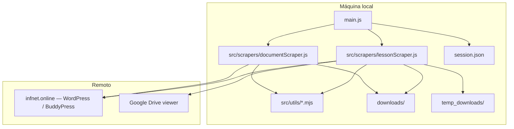
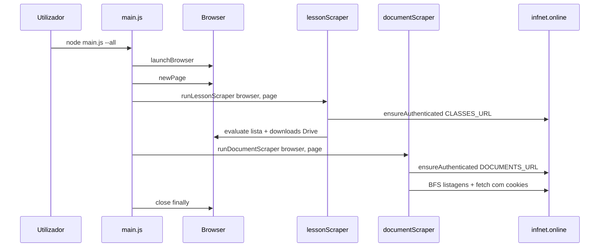
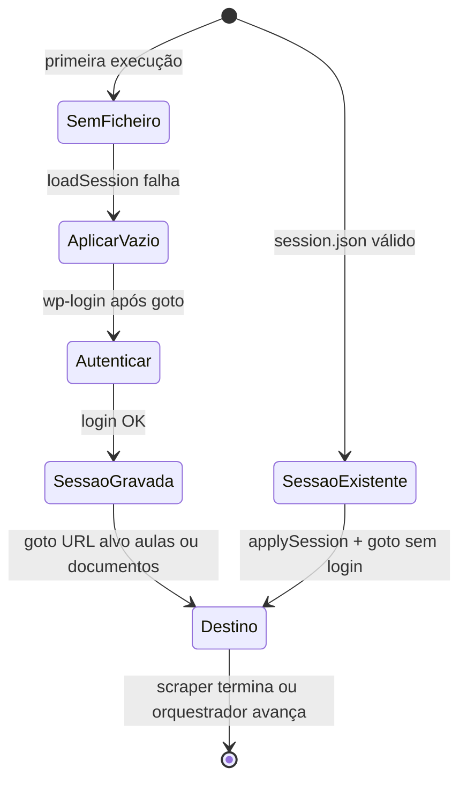

# StripperScrapper — Documentação técnica

> Documento mestre de arquitetura, fluxos e operação. O [README.md](./README.md) permanece o ponto de entrada rápido; este ficheiro aprofunda **propósito**, **comportamento do código** e **limites** do sistema.

## Table of Contents

- [Visão geral](#visão-geral)
- [Propósito e público-alvo](#propósito-e-público-alvo)
- [O que o projeto faz (e o que não faz)](#o-que-o-projeto-faz-e-o-que-não-faz)
- [Stack e pré-requisitos](#stack-e-pré-requisitos)
- [Visão do sistema](#visão-do-sistema)
- [Estrutura de pastas e entrypoints](#estrutura-de-pastas-e-entrypoints)
- [Orquestrador `main.js`](#orquestrador-mainjs)
- [Modo cluster / multi-worker](#modo-cluster--multi-worker)
- [Módulo de aulas — `lessonScraper.js`](#módulo-de-aulas--lessonscraperjs)
- [Módulo de documentos — `documentScraper.js`](#módulo-de-documentos--documentscraperjs)
- [Utilitários `src/utils/`](#utilitários-srcutils)
- [Manifest e idempotência](#manifest-e-idempotência)
- [Fluxos de dados e estado](#fluxos-de-dados-e-estado)
- [Ciclo de vida da sessão](#ciclo-de-vida-da-sessão)
- [Referência CLI e variáveis de ambiente](#referência-cli-e-variáveis-de-ambiente)
- [Saídas no disco](#saídas-no-disco)
- [API programática (`toMarkdown`)](#api-programática-tomarkdown)
- [Segurança, privacidade e conformidade de uso](#segurança-privacidade-e-conformidade-de-uso)
- [Limitações e manutenção](#limitações-e-manutenção)
- [Troubleshooting](#troubleshooting)
- [Relação entre README, este documento e histórico de agente](#relação-entre-readme-este-documento-e-histórico-de-agente)

---

## Visão geral

**StripperScrapper** é uma ferramenta **local** (Node.js + Puppeteer) que automatiza, para um utilizador autenticado no portal académico **Infnet** (`infnet.online`, WordPress):

1. **Aulas / transcrições** — navegação até à página de reuniões/gravações, links para transcrições (tipicamente **Google Drive**), download via CDP e materialização em `downloads/<secção>/` com `.md` adjacente.
2. **Documentos BuddyPress** — percurso recursivo em `/documents/` e pastas, extração de URLs no DOM, download com **cookies da sessão** via `fetch` no Node.

O **ponto de entrada recomendado** é [`main.js`](./main.js): um único processo pode correr **só aulas**, **só documentos** ou **ambos em sequência** com **uma instância do browser** (menos logins redundantes). Cada scraper exporta `run*ScraperStandalone()` para arranque isolado (browser próprio), útil em depuração.

Não existe servidor HTTP, fila de jobs nem API exposta: tudo corre na máquina do utilizador.

---

## Propósito e público-alvo

| Aspeto | Descrição |
|--------|-----------|
| **Problema** | Conteúdos ficam atrás de login e de UI web (Drive, listagens BuddyPress), sem endpoint público estável para integração. |
| **Solução** | Replicar o fluxo humano com browser controlado; transcrições com CDP + rename + `.md`; documentos com `fetch` autenticado. |
| **Quem usa** | Alunos ou equipas com **acesso legítimo** ao conteúdo da própria turma, que queiram **cópia local** organizada. |

O nome do repositório é um jogo de palavras com “strip” (extração) e “scraper”; o âmbito é **extração autorizada** para uso pessoal/académico, não exploração de terceiros.

---

## O que o projeto faz (e o que não faz)

**Faz**

- Arranca Chrome (ou caminho definido em env), opcionalmente em modo headed (`--headed` / `HEADLESS=0`).
- Reutiliza ou cria `session.json` (cookies + `localStorage`) via `infnetShared.mjs`.
- **Aulas:** lista `.infnetci-recording-item` com `.transcription-link`; por item abre o viewer do Drive, configura pasta de download, clica em “Baixar”, move ficheiro estável de `temp_downloads/` e gera `.md`.
- **Documentos:** BFS em pastas BuddyPress, filtra extensões (por defeito `pdf`, `pptx`, `xlsx`), regista conclusões no **manifest** quando aplicável.
- **Orquestrador:** opções `--all`, `--lessons`, `--docs`, `--fail-fast` (ou `ORCHESTRATOR_FAIL_FAST`); `browser.close()` em `finally`.

**Não faz**

- Não fornece credenciais nem contorna MFA fora do que o browser já tiver em sessão.
- Não garante compatibilidade perpétua com alterações de HTML no Infnet, no Drive ou em BuddyPress.
- Não substitui políticas da instituição ou termos de serviço: o utilizador é responsável pelo uso conforme contratos e leis aplicáveis.

---

## Stack e pré-requisitos

| Componente | Detalhe |
|------------|---------|
| **Runtime** | Node.js com **ESM** (`"type": "module"` em `package.json`). |
| **Automação** | `puppeteer` (Chrome/Chromium). |
| **CLI** | `commander` em `main.js` (flags do orquestrador; opções dos scrapers permanecem em `process.argv` graças a `.allowUnknownOption()`). |
| **Config** | `dotenv` — `import 'dotenv/config'` em `main.js`. |
| **Entrypoint principal** | [`main.js`](./main.js). |
| **Lógica de scraping** | [`src/scrapers/lessonScraper.js`](./src/scrapers/lessonScraper.js), [`src/scrapers/documentScraper.js`](./src/scrapers/documentScraper.js). |

**Chrome:** `resolveExecutablePath` / `launchBrowser` em `src/utils/browser.mjs` tentam `PUPPETEER_EXECUTABLE_PATH`, depois **deteção por SO** (`detectSystemChrome` em `infnetShared.mjs`), e caso contrário o binário gerido pelo Puppeteer. Se o launch falhar com mensagem do tipo “Could not find Chrome”, imprime-se `printChromeHelp`.

---

## Visão do sistema



---

## Estrutura de pastas e entrypoints

| Path | Papel |
|------|--------|
| `main.js` | Orquestrador CLI: lança browser, chama `runLessonScraper` e/ou `runDocumentScraper` na mesma `page` quando em modo combinado. |
| `src/scrapers/lessonScraper.js` | Transcrições / Drive + manifest `transcript`. Exporta `parseLessonArgs`, `runLessonScraper`, `runLessonScraperStandalone`, `toMarkdown`. |
| `src/scrapers/documentScraper.js` | Documentos BuddyPress + manifest `document`. Exporta `parseDocumentArgs`, `runDocumentScraper`, `runDocumentScraperStandalone`. |
| `src/utils/infnetShared.mjs` | Sessão, login, Chrome, `projectRoot`, `safeDirName` / `safeFileName`, `gotoUrl`, `ensureAuthenticated`. |
| `src/utils/downloadManifest.mjs` | `manifest.json`, IDs estáveis, `isItemCompleted`, `markArtifactCompletedIfPresent`. |
| `src/utils/browser.mjs` | `launchBrowser`, `buildLaunchOptions`, `resolveExecutablePath`. |
| `src/utils/logging.mjs` | `logSectionBanner` — prefixo `[SEÇÃO]` no orquestrador. |
| `src/utils/shard.mjs` | Sharding determinístico: `partitionTasksForWorker(tasks, workerIndex, workerCount)` para distribuir trabalho entre workers. |
| `src/utils/workerLog.mjs` | Logs por worker: prefixos `[WORKER-n][AULAS]` / `[WORKER-n][DOCS]`, cores (`chalk`) e helpers para consolidar saída no pai. |

---

## Orquestrador `main.js`

| Opção | Efeito |
|-------|--------|
| `--all` | Executa aulas e, em seguida, documentos na **mesma** instância do browser (mesmo contexto de cookies). |
| `--lessons` | Apenas `runLessonScraper`. |
| `--docs` | Apenas `runDocumentScraper`. |
| `--workers <n>` | Ativa concorrência por **multi-worker** (ver secção seguinte). Default: `2`. |
| `--sequential` | Força o comportamento antigo: um browser e execução em sequência (sem sharding). |
| `--fail-fast` | Se o módulo de **aulas** lançar exceção, **não** corre o módulo de documentos. |
| *(outras flags)* | Permanecem em `argv` (ex.: `--limit=`, `--headed`, `--documents-url=`) para os parsers dos scrapers. |

Variável **`ORCHESTRATOR_FAIL_FAST`** (`1` / `true` / `yes`) equivale a `--fail-fast`.

Fluxo resumido: `launchBrowser` → `browser.newPage()` → secção aulas (se ativa) → secção documentos (se ativa e não abortada por fail-fast) → `browser.close()` no `finally`, com log `[ORQUESTRADOR] A fechar o browser…`.

**Nota:** `node main.js` sem `--lessons`, `--docs` ou `--all` mostra a ajuda do Commander e termina com código de saída 1.

---

## Modo cluster / multi-worker

Esta secção descreve o modo de concorrência introduzido no `main.js`, em que a execução passa a ter **um processo pai** que faz o *crawl* (mapeamento de tarefas) e **N workers** que fazem o *download* em paralelo.

### Quando o cluster ativa vs quando fica sequencial

- **Ativa (cluster / multi-worker)** quando:
  - `--workers <n>` é fornecido com \(n > 1\), **e**
  - `--sequential` **não** foi usado.

- **Fica sequencial** quando:
  - `--sequential` é usado (independente do valor de `--workers`), ou
  - `--workers 1` é usado (efeito equivalente a um único worker), ou
  - o utilizador escolhe um fluxo compatível com o comportamento antigo (um browser e etapas em série).

### Visão de alto nível (fases)

1. **Fase de mapeamento (crawl)** — o pai abre **um browser** e descobre a lista de tarefas:
   - Aulas: `discoverLessonTasks`
   - Documentos: `discoverDocumentTasks`

2. **Fase de distribuição (sharding)** — o pai divide as tarefas em N partições determinísticas com `partitionTasksForWorker(tasks, workerIndex, workerCount)`.

3. **Fase de download** — o pai lança `Promise.all` e cada worker:
   - abre o seu **próprio browser** (por defeito **headless** para reduzir RAM),
   - executa `runLessonScraper` e/ou `runDocumentScraper` com `{ tasks }` (sem refazer crawl),
   - escreve logs com prefixos por worker e devolve status para o resumo final.

### Compatibilidade de flags e modo headless/headed

- **Compatíveis / inalteradas**: `--all`, `--lessons`, `--docs` continuam a selecionar módulos.
- **Headless por defeito no cluster**: workers executam em headless salvo `--headed`/`--show`. (Nota: `HEADLESS=0` continua útil para o browser de mapeamento; no cluster, os workers ignoram `HEADLESS=0` para economizar RAM.)
- **`--sequential`**: força um browser e execução em sequência (útil para depuração ou ambientes com pouca RAM).

### Exemplos de comandos (copiáveis)

```bash
# Aulas + documentos, concorrência com 4 workers
node main.js --all --workers 4

# Apenas aulas, concorrência com 3 workers
node main.js --lessons --workers 3

# Apenas documentos, concorrência com 2 workers
node main.js --docs --workers 2

# Forçar execução antiga (sequencial) mesmo que --workers exista
node main.js --all --sequential

# Ver browsers (headed) — útil para depuração
node main.js --all --workers 2 --headed
```

### Idempotência e filtragem antes do sharding

Para evitar desperdício de recursos em modo concorrente, o fluxo é:

- **Antes do sharding**, o pai filtra tarefas usando o **manifest** (ver `downloads/manifest.json`) e remove as já concluídas (ou cujo artefacto ainda existe, quando aplicável).  
- Só as tarefas “pendentes” são distribuídas entre workers via `partitionTasksForWorker`.

Isto mantém o processo **idempotente**: reexecutar com os mesmos inputs não rebaixa o estado nem redescarga itens já finalizados, exceto quando o utilizador apagar artefactos no disco (caso em que a verificação do artefacto pode voltar a marcar como pendente).

### Diretórios temporários por worker (evitar colisões)

No módulo de aulas, cada worker usa um subdiretório próprio:

- `temp_downloads/worker-<id>`

Isto evita colisões de ficheiros quando múltiplos Chrome estão a descarregar em paralelo, e simplifica a limpeza/diagnóstico.

### Logging e resumo final

- **Logs por worker**: prefixos e cores via `chalk`, por exemplo:
  - `[WORKER-1][AULAS] ...`
  - `[WORKER-2][DOCS] ...`
- **Resumo final do pai**: contabiliza quantos workers terminaram **OK** vs **falha**, para que seja possível identificar rapidamente partições problemáticas.

### Limites práticos e recomendações

O modo multi-worker aumenta throughput, mas os limites passam a ser:

- **RAM**: cada browser+contexto consome memória; em máquinas modestas, \(n\) alto degrada ou falha.
- **CPU**: renderização + execução de JS no portal/Drive escala com o número de browsers.
- **Rede**: downloads em paralelo competem por largura de banda; pode haver throttling.

Recomendação prática: começar com **2–4 workers** e só aumentar se a máquina aguentar (e se o gargalo for rede/IO, não UI/CPU).

---

## Módulo de aulas — `lessonScraper.js`

Concentra o fluxo histórico do antigo `stripper.js`: **parse de argumentos**, integração com **manifest**, **lista na página de aulas**, **orquestração por aula** (Drive, download, mover, Markdown). As funções de sessão (`ensureAuthenticated`, etc.) vivem em `infnetShared.mjs`.

### Constantes e configuração

| Símbolo | Função |
|---------|--------|
| `DEFAULT_CLASSES_URL` | URL exemplo da página de reuniões; sobrescrita por `CLASSES_URL`. |
| `BASE_ORIGIN` | `https://infnet.online` — definido em `infnetShared.mjs`, usado em `applySession`. |

### Argumentos CLI (`parseLessonArgs`)

| Argumento | Efeito |
|-----------|--------|
| `--limit=N` | Processa no máximo `N` itens com link válido (ordem da lista na página). |
| `--no-download` | Só regista URLs e metadados no log (`dry-run`). |
| `--headed` / `--show` | Browser visível (também `HEADLESS=0` no `.env`). |

### Nomes e pastas

| Função | Responsabilidade |
|--------|------------------|
| `humanizePathSegment` / `cleanGroupSlug` / `courseFromClassesUrl` | Derivar rótulo de curso a partir do path da URL. |
| `resolveCourseTitle` | Ordem: `DISCIPLINE_NAME` / `COURSE_NAME` → texto da página (acordeão, `h1`, `document.title`) → URL → fallback `"Disciplina"`. |
| `slugify` | Nome de ficheiro estável a partir do título da aula. |
| `safeDirName` | Em `infnetShared.mjs`; remove caracteres inválidos no **Windows** (`opts.maxLen` / `fallback` usados pelo scraper). |

### Lista e download

| Função | Responsabilidade |
|--------|------------------|
| `gotoClasses` | Delega `gotoUrl(page, classesUrl, 800)`. |
| `setDownloadPath` | CDP `Page.setDownloadBehavior` para `temp_downloads/`. |
| `listFileNames` / `waitNewStableFile` | Deteção de ficheiro novo estável (ignora `.crdownload`/`.tmp`, compara tamanhos). |
| `openTranscriptPageByIndex` | Clica no link da aula; suporta **popup** (`waitForTarget`) ou navegação na mesma página se já for Drive. |
| `clickDriveDownload` | Itera **frames** e tenta lista fixa de seletores `aria-label` / `data-tooltip` (PT/EN). |

### `runLessonScraper({ browser, page }, opts?)`

1. Garante pastas `downloads/` e `temp_downloads/` (relativas a `projectRoot`).
2. `ensureAuthenticated(page, classesUrl, sessionPath, user, pass, { gotoSettleMs: 800 })`.
3. Se `opts.tasks` for fornecido (modo cluster), **não refaz** o crawl e usa a lista já mapeada (com `domIndex`); caso contrário, faz `page.evaluate` para recolher `{ title, href, accordionTitle }` por `.infnetci-recording-item`.
4. Loop (até `--limit`): verificação de manifest; opcionalmente dry-run; senão download + rename + `toMarkdown`; fecha popup se diferente da página principal; `gotoClasses`.
5. **Não** chama `browser.close()` — responsabilidade do chamador (`main.js` ou `runLessonScraperStandalone`).

Em modo cluster, recomenda-se que cada worker use um diretório temporário próprio via `opts.tempDownloadsDir` (por exemplo `temp_downloads/worker-<id>`), evitando colisões ao aguardar ficheiros estáveis.

`runLessonScraperStandalone(opts?)` lança browser próprio, cria página, corre o scraper e fecha no `finally` (pode receber `tasks` do modo cluster).

---

## Módulo de documentos — `documentScraper.js`

| Aspeto | Detalhe |
|--------|---------|
| **Navegação** | `page.goto` em cada URL de pasta; scroll suave para conteúdo lazy; `page.evaluate(extractListingScript)` devolve pastas + ficheiros. |
| **Download** | `fetch` no Node com header `Cookie` montado a partir de `page.cookies()`, streaming para disco, limite `DOCUMENTS_MAX_BYTES`, timeout `DOCUMENTS_FETCH_TIMEOUT_MS`. |
| **Idempotência** | `stableDocumentItemId`, `resolveManifestRootAndPath` (manifest partilhado sob `downloads/manifest.json` quando a saída está dentro de `downloads/`). |

### Argumentos CLI (`parseDocumentArgs`)

| Argumento | Efeito |
|-----------|--------|
| `--documents-url=` | URL raiz da área de documentos. |
| `--output=` | Diretório raiz da árvore descarregada (absoluto após `path.resolve`). |
| `--dry-run` / `--no-download` | Só listagem no log. |
| `--ignore-manifest` | Ignora manifest (ou env `DOCUMENTS_IGNORE_MANIFEST`). |
| `--max-depth=` | Profundidade máxima de pastas. |
| `--extensions=` | Lista separada por vírgula (extensões sem ponto). |
| `--headed` / `--show` | Browser visível no modo standalone. |

`discoverDocumentTasks({ browser, page })` autentica e percorre pastas para gerar a lista plana de tarefas (BFS + extração de links), sem download.

`runDocumentScraper({ browser, page }, opts?)` assume `page` já criada; aplica `setDefaultNavigationTimeout(120000)` e autentica em `DOCUMENTS_URL`.

- Sem `opts.tasks`: percorre a fila BFS e baixa ficheiros inline (modo standalone/sequencial).
- Com `opts.tasks`: baixa apenas as tarefas fornecidas (modo cluster), sem refazer o crawl.

**Não** fecha o browser quando chamado pelo orquestrador.

---

## Utilitários `src/utils/`

| Módulo | Conteúdo principal |
|--------|---------------------|
| `infnetShared.mjs` | `projectRoot` (raiz do repo), `ensureDir`, `fileExists`, `detectSystemChrome`, `printChromeHelp`, `loadSession` / `saveSession` / `applySession`, `login`, `gotoUrl`, `ensureAuthenticated`, `safeDirName`, `safeFileName`. `saveSession` grava `session.json` sob lock (`session.json.write.lock`) e de forma atómica. |
| `downloadManifest.mjs` | Versão do schema, `stableTranscriptItemId`, `stableDocumentItemId`, `resolveManifestRootAndPath`, `isItemCompleted`, `markArtifactCompletedIfPresent`, fila de escrita atómica por path de manifest; lock `manifest.json.queue.lock` para proteger read-modify-write em concorrência. |
| `browser.mjs` | Consolidação do `puppeteer.launch` e mensagens de UI headed; opção `preferHeadlessUnlessHeaded` para workers (headless por defeito no cluster salvo `--headed`). |
| `logging.mjs` | Banners `[SEÇÃO]` entre blocos do orquestrador. |
| `workerLog.mjs` | Prefixos e cores por worker no modo cluster. |
| `shard.mjs` | Particionamento determinístico de tarefas por worker. |

---

## Manifest e idempotência

O ficheiro **`downloads/manifest.json`** (ou sob a raiz de saída dos documentos quando esta está fora de `downloads/`) regista entradas por **ID estável** (`transcript:gdrv:…`, `document:bp:…`, ou hash de URL). Antes de voltar a descarregar, `isItemCompleted` pode exigir que os ficheiros no disco ainda existam (`verifyArtifact` + `manifestRoot`), para evitar omitir download após apagamento manual.

---

## Fluxos de dados e estado

### Orquestrador com aulas e documentos (`--all`)



### Apenas transcrições (`--lessons`)

Equivale ao ramo `L` até `browser.close()` (no `main.js` ou no standalone).

---

## Ciclo de vida da sessão



O mesmo `session.json` na raiz do repo serve **aulas** e **documentos** no mesmo browser.

### Concorrência e integridade (`session.json` / `manifest.json`)

No modo multi-worker, múltiplos processos podem tentar persistir estado em simultâneo. Para manter integridade:

- **`session.json`**: escrita atómica protegida por lock `session.json.write.lock`.
- **`downloads/manifest.json`**:
  - lock `manifest.json.queue.lock` cobrindo o ciclo **read-modify-write** (além da fila em memória),
  - escrita atómica com fallback específico para Windows quando necessário.

---

## Referência CLI e variáveis de ambiente

### Scripts npm

| Comando | Equivalente |
|---------|-------------|
| `npm start` | `node main.js` (exige `--lessons`, `--docs` ou `--all`) |
| `npm run main` | `node main.js` |
| `npm run all` | `node main.js --all` |
| `npm run lessons` | `node main.js --lessons` |
| `npm run docs` | `node main.js --docs` |
| `npm run stripper` | `node main.js --lessons` |
| `npm run documents` | `node main.js --docs` |

Modo **standalone** (browser próprio), por exemplo para depuração:

```javascript
import { runLessonScraperStandalone } from './src/scrapers/lessonScraper.js';
await runLessonScraperStandalone();
```

### Variáveis de ambiente — aulas / geral

| Variável | Obrigatório | Descrição |
|----------|-------------|-----------|
| `FACULDADE_USER` | Se após aplicar sessão ainda for necessário login | E-mail WordPress Infnet. |
| `FACULDADE_PASS` | Idem | Senha. |
| `CLASSES_URL` | Não | URL da página de reuniões; default igual ao exemplo em código. |
| `DISCIPLINE_NAME` ou `COURSE_NAME` | Não | Nome da disciplina nos metadados; senão inferido. |
| `PUPPETEER_EXECUTABLE_PATH` | Condicional | Caminho absoluto para o Chrome se a resolução automática falhar. |
| `HEADLESS` | Não | `0` força browser visível (junto com `--headed`). |
| `ORCHESTRATOR_FAIL_FAST` | Não | `1` / `true` / `yes` — mesmo efeito que `--fail-fast` no `main.js`. |

### Variáveis de ambiente — documentos

| Variável | Descrição |
|----------|-----------|
| `DOCUMENTS_URL` | URL raiz da área de documentos. |
| `DOCUMENTS_OUTPUT_DIR` | Pasta de saída (default `downloads/documents` sob `projectRoot`). |
| `DOCUMENTS_MAX_DEPTH` | Profundidade máxima de pastas (default 32). |
| `DOCUMENTS_MAX_BYTES` | Limite por ficheiro (default 500 MiB). |
| `DOCUMENTS_FETCH_TIMEOUT_MS` | Timeout do `fetch` (default 300000). |
| `DOCUMENTS_IGNORE_MANIFEST` | `1` / `true` / `yes` — ignora manifest. |

### Exemplos copiáveis

```bash
copy .env.example .env
# editar .env, depois:
npm install
npm run lessons -- --limit=1
```

```powershell
# Windows PowerShell — sessão visível
$env:HEADLESS="0"; npm run lessons -- --limit=2
```

---

## Saídas no disco

| Caminho | Conteúdo | Versionamento |
|---------|----------|----------------|
| `downloads/<Secção>/` | Ficheiros de transcrição + `.md` por item | Ignorado pelo Git (`.gitignore`). |
| `downloads/documents/` | Árvore de documentos BuddyPress (por defeito) | Ignorado. |
| `downloads/manifest.json` | Idempotência (transcrições + documentos quando a saída está sob `downloads/`) | Tipicamente ignorado / local. |
| `temp_downloads/` | Buffer de download do Chrome | Ignorado. |
| `session.json` | Cookies + `localStorage` | Ignorado — **não commitar**. |
| `.env` | Credenciais locais | Ignorado. |

### Front-matter YAML (campos)

| Campo | Origem |
|-------|--------|
| `title` | Título da aula (`h3` dentro do item) ou `aula_N`. |
| `source_url` | `href` do `.transcription-link`. |
| `course` | Rótulo da secção (acordeão) ou nome resolvido da disciplina. |
| `transcript_file` | Nome do ficheiro binário descarregado. |
| `downloaded_at` | ISO-8601 no momento do processamento. |

---

## API programática (`toMarkdown`)

Outro módulo ESM pode importar:

```javascript
import { toMarkdown } from './src/scrapers/lessonScraper.js';

await toMarkdown('/caminho/para/ficheiro.vtt', {
  title: 'Aula 1',
  source_url: 'https://…',
  course: 'Nome da disciplina',
  downloaded_at: new Date().toISOString(), // opcional
});
```

Isto escreve `ficheiro.md` ao lado de `ficheiro.vtt`. A função não depende do Puppeteer.

---

## Segurança, privacidade e conformidade de uso

- **Credenciais:** ficam apenas em `.env` local; nunca devem ir para o repositório remoto.
- **`session.json`:** equivale a estado de sessão autenticada; tratar como secreto e manter fora do Git.
- **Superfície de ataque:** o projeto não abre portas nem escuta rede; o risco principal é **exposição de ficheiros sensíveis** no disco ou em backups partilhados.
- **Termos de serviço:** scraping/automação pode conflitar com políticas da Infnet ou Google; esta documentação **não** constitui aconselhamento jurídico — avaliar conformidade no contexto institucional.

---

## Limitações e manutenção

1. **Seletores frágeis:** `.infnetci-recording-item`, `.transcription-link`, botões do Drive, listagens BuddyPress e login WordPress podem mudar; o código mitiga com listas de seletores, mas não há garantia eterna.
2. **`VALIDACAO_SELETORES.md`:** referenciado no README como notas de validação; no `.gitignore` do projeto pode estar excluído — se existir localmente, serve de checklist de regressão visual.
3. **Vários módulos:** alterações podem exigir tocar em `lessonScraper.js`, `documentScraper.js` ou `src/utils/`; convém diff focado e testes manuais com `--limit=1`, `--headed` ou `--dry-run`.
4. **Erros por aula:** falhas num item registam-se no stderr e o loop tenta continuar com as seguintes, voltando à lista com `gotoClasses`.
5. **Erros por documento:** o BFS regista erros por ficheiro e continua; contagens aparecem no resumo `[FIM]`.

---

## Troubleshooting

<details>
<summary>Chrome não encontrado ao lançar</summary>

Verificar instalação do Google Chrome ou definir `PUPPETEER_EXECUTABLE_PATH`. Em ambientes com pouco disco, instalar dependências com `PUPPETEER_SKIP_DOWNLOAD=true` implica quase sempre apontar para Chrome do sistema. Mensagens de ajuda são impressas por `printChromeHelp`.
</details>

<details>
<summary>Lista vazia — “Nenhum .infnetci-recording-item encontrado”</summary>

O script regista um diagnóstico mínimo (`count` de itens e `snippet` do texto da página). Causas típicas: sessão sem permissão para a turma, URL errada, ou HTML alterado. Correr com `--headed` para inspecionar; atualizar seletores em `src/scrapers/lessonScraper.js` se o layout mudou.
</details>

<details>
<summary>Timeout no download ou “Botão de download não encontrado”</summary>

UI do Drive varia (iframe, idioma, consentimentos). O código percorre frames e vários `aria-label`; pode ser necessário interação manual uma vez ou acrescentar seletores.
</details>

<details>
<summary>Login falha após credenciais corretas</summary>

Verificar MFA ou captchas (não tratados pelo script). Limpar `session.json` e tentar de novo com `--headed` para ver o estado da página.
</details>

<details>
<summary>Documentos: resposta HTML em vez de PDF</summary>

O downloader deteta cabeçalho tipo HTML e apaga o ficheiro parcial — típico de sessão expirada ou URL sem permissão. Verificar `DOCUMENTS_URL` e voltar a autenticar.
</details>

---

## Relação entre README, este documento e histórico de agente

| Artefacto | Papel |
|-----------|--------|
| [README.md](./README.md) | Onboarding, quick start, troubleshooting resumido. |
| **documentation.md** (este ficheiro) | Referência técnica: pastas `src/`, orquestrador, scrapers, manifest, `toMarkdown`. |
| `.agent_history.md` | Se existir na raiz, regista decisões de fluxos de agente; consolidar alterações relevantes aqui quando o histórico estiver disponível. |

---

*Em caso de divergência entre este texto e o comportamento observado, o código em `main.js` e em `src/` prevalece.*
